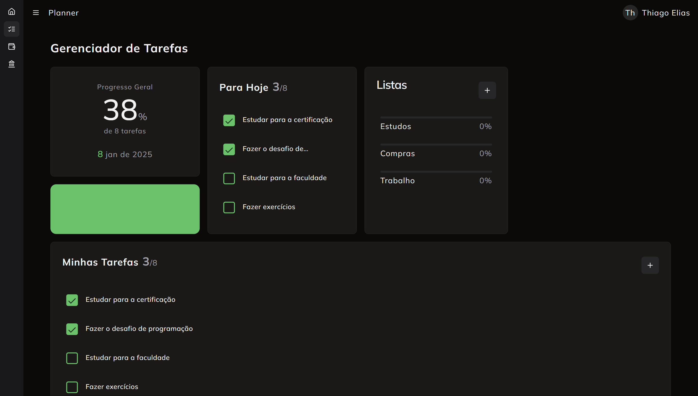
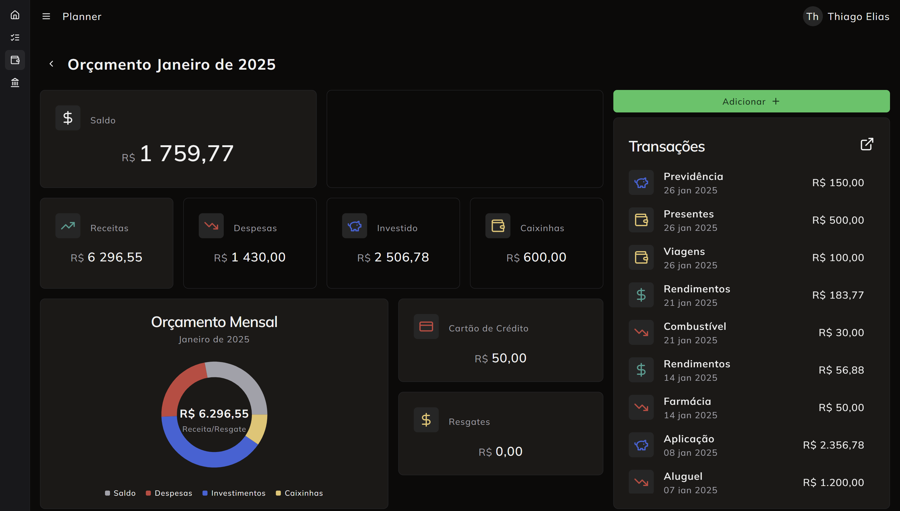
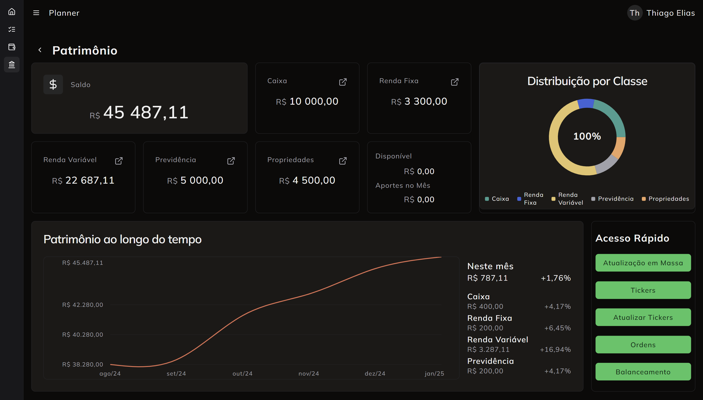

<h1 align="center">Planner - Aplicação de Organização Pessoal</h1>

Bem-vindo ao **Planner**, uma aplicação personalizada de planejamento pessoal com objetivo a organizar tarefas, gerenciar o planejamento financeiro mensal e acompanhar investimentos de forma eficiente e intuitiva.

### Acesse a versão de demonstração da aplicação

[Planner - Aplicação de Organização Pessoal](https://planner-neon-rho.vercel.app/)

- Os dados cadastrados são apagados semanalmente

### Recursos Gerais da Aplicação

- Design moderno e otimizado para acesso mobile e desktop
- Animações básicas e pontuáis que não atrapalham a usabilidade
- Login facilitado por email, google e github
- Dashboards objetivos com indicadores e gráficos
- Formulários de preenchimento facilitado
- Desenvolvido seguindo práticas de Clean Code e Domain Driven Design
- Acesso a api`s de terceiros
- Otimização de dados para requisições mais eficazes e menos frequentes

### Módulo de Controle de Tarefas

#### Recursos

- Criaçao e gerenciamento de tarefas
- Criaçao e gerenciamento de lista de tarefas
- Recurço de arrastar e soltar
- Outros recursos em desenvolvimento
  - Inclusão de data de conclusão
  - Visualização kamban e caledário

### Módulo de Planejamento Financeiro Mensal

#### Recursos

- Criaçao e gerenciamento de transações
- Criaçao e gerenciamento de transações com recorrencia anual/mensal/diária
- Categorização das transações
- Outros recursos em desenvolvimento
  - Histórico de transações recorrentes
  - Histórico por período
  - Integração com Open Finance

### Módulo de Controle de Investimentos

#### Recursos

- Cadastro de investimentos de renda fixa com taxa pré-fixada ou indices pós-fixados
- Cadastro de investimentos de renda variavel (ações, etfs, fundos) com atualização automática de preço
- Cadastro de valores em caixa / conta corrente / previdência
- Cadastro de bens (imóveis / automóveis)
- Histórico do patrimônio
- Acompanhamento do balanceamento dos ativos com base em regra pré-definida
- Acompanhamento do rendimento dos ativos no mês
- Calculo de DARF e preço médio de ações
- Outros recursos em desenvolvimento
  - Integração com CEI/B3
  - Exportação para declaração de imposto de renda
  - Exportação em .csv

### Instalação

#### Requisitos

- [Node.js](https://nodejs.org/pt)
- Banco de dados postgress
- [Projeto no Kinde](https://kinde.com/)
- API Key da [Aplha Vantage](https://www.alphavantage.co/)

#### Configuração

1. Clone do repositório
   `https://github.com/planner-teliasapp/planner`
1. Navegue até o diretório  
   `planner-web-next`
1. Renomear o arquivo `.env.example` para `.env` e preencher as informações de conexão do banco de dados, Kinde e Alpha Vantage
1. Instale as dependências necessárias
   `npm install`
1. Preparar o banco de dados
   `npm run prepare`
1. (_Opcional_) Executar seed no banco de dados
   `npm run seed`
1. Iniciar aplicação
   `npm run start`

### Contribuição

Contribuições são bem-vindas! Para contribuir com o Planner, siga os passos:

1. Faça um fork do repositório.
2. Crie uma branch para sua nova funcionalidade:  
   `git checkout -b minha-nova-funcionalidade`
3. Commit suas mudanças:  
   `git commit -m "Adiciona nova funcionalidade"`
4. Envie suas alterações:  
   `git push origin minha-nova-funcionalidade`
5. Abra um pull request.

### Licença

Este projeto está licenciado sob a MIT License. Sinta-se à vontade para usar, modificar e compartilhar conforme os termos da licença.
